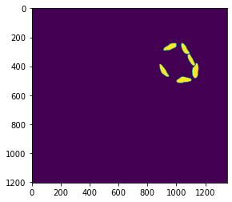
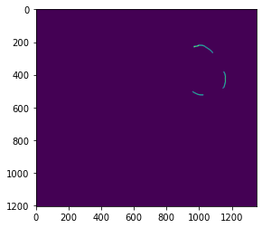
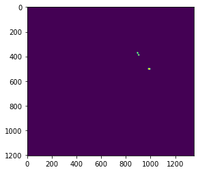

# 3D Organelle Distances 
## Background 

As described in Harwood et al., (2020) https://nph.onlinelibrary.wiley.com/doi/full/10.1111/nph.16219 we imaged 3 different chickpea genotypes with serial block face 
scanning electron microscopy (SBF-SEM). We furthered our previous work by segmenting the mitochondria and measuring  mesophylly conductance (gm) at 21% and 2% Oxygen. 

## Here is what a chickpea mesophyll cell looks like (chloroplasts are green, mitochondria are red and the cell wall is white)
  


## Why?
Mesophyll conductance (gm) refers to the passage of CO2 as a gas and a liquid from the sub-stomatal airspace to the site of carboxylation inside the chloroplast. 
gm is influenced by aquaporins, carbonic anhydrase and leaf anatomy. 
An important part of understanding gm is quantifying the role respiration and photorespiration has.
Estimates of gm are influenced by the amount of respiratory and photorespiratory CO2 released from the mitochondria diffusing towards the chloroplasts the ratio of
recapture vs leakage to the atmosphere is not uniform across species and likely related to the position of the mitochondria, the surface are area of mesophyll exposed
to the airspace and the surface area of chloroplast exposed to the airspace. 

## Relevent anatomical information 

We take the 3D images/models and calculate a suite of distance metrics


## Calculating the distance metrics
The images are broken down into 5 different "parts" and loaded into Python as follows

Start by loading packages
```python 
import numpy as np
import os
from scipy.ndimage.morphology import distance_transform_edt, binary_erosion
import skfmm
import imageio
import skimage.io as io
from skimage import img_as_ubyte, img_as_bool, img_as_float32
from skimage.util import invert
from skimage.measure import label, regionprops, marching_cubes_lewiner, mesh_surface_area
import matplotlib.pyplot as plt
from scipy import stats
from scipy.ndimage import zoom
import gc
```
We then define two functions - one to "erode" surfaces to create outlines and one to threshold specific gray scale values

```python
def Erosion3DimJ(input_img):
    tmp = np.zeros(input_img.shape)
    for i in range(input_img.shape[0]):
        tmp[i, :, :] = binary_erosion(input_img[i, :, :])
    return tmp

def Threshold(input_img, Th_value):
    tmp = np.zeros(input_img.shape, dtype=np.bool)
    if isinstance(Th_value, int):
        tmp[input_img == Th_value] = 1
    else:
        if isinstance(Th_value, float):
            tmp[input_img > 0. & input_img < 1.] = 1
        else:
            for th_val in range(len(Th_value)):
                tmp[input_img == Th_value[th_val]] = 1
    return tmp
```
We then set file locations and names of tiffs (This is all automated later from a master scipt)
```python 
image_dir = 'Z:/ALLTIFS3DMIT/';sample="D2C1_"
import runpy;import os;os.chdir('C:/Users/Richard/Desktop/Organelles/OrganelleScripts/')
chl_name='D2C1CHL.tif';mit_name='D2C1MIT.tif';cell_w_org_name="D2C1VAC.tif"
cell_name="D2C1CELL.tif";air_name="D2C1AIR.tif"
```
Now we set voxel dimensions 
```python 
voxel_dims = [0.05,0.04,0.04] 
```
Load in chloroplast images 
```python 
chl=io.imread(image_dir + chl_name)
chl=zoom(chl, (1, 0.5, 0.5)) #This is the same as Image > adjust >size in FIJI
chl[chl==0] = 0
chl[chl==1] = 255
chl=img_as_bool(chl)
plt.imshow(chl[400])
```


Load in air images 
```python 
air=io.imread(image_dir + air_name)
air=zoom(air, (1, 0.5, 0.5)) #This is the same as Image > adjust >size in FIJI
air[air==0] = 0
air[air==1] = 255
air=img_as_bool(air)
io.imshow(air[400])
```


```python
mito = io.imread(image_dir + mit_name)
mito=zoom(mito, (1, 0.5, 0.5))
mito[mito==0] = 0
mito[mito==1] = 255
plt.imshow(mito[400])
mito=img_as_bool(mito)
```


These are the images we need for this calculation 
To make the simulation run we need a chl +mit image (these are the "obstructions" in the cell)

```python 
chl_mito = chl + mito
```

The technique used here gets a distance value for every voxel, but we are only intersted in teh mitochondria edge, so lets extract that:

```python 
mito_outline_smaller = Erosion3DimJ(invert(mito))
mito_edge = invert(Threshold(invert(mito)-mito_outline_smaller, 0))
mito_edge[0,:,:] = False
mito_edge[-1,:,:] = False
mito_edge[:,0,:] = False
mito_edge[:,-1,:] = False
mito_edge[:,:,0] = False
mito_edge[:,:,-1] = False
del mito_outline_smaller
plt.imshow(mito_edge[400])
```


We now create an array which will have the start point (the air) and the obstructions (chl +mit)

```python 
air_masked_array = np.ma.masked_array(invert(air), chl_mito)
```
We then get the distance for every voxel in the 3D image stack

```python 
D_geo_from_air = skfmm.distance(air_masked_array, dx=voxel_dims)
```
Then we extract the values at the mitochndria edge 

```python 
L_geo_edge_air_mit = np.asarray(D_geo_from_air[(mito_edge == True)])
```
Then we export these values as a .CSV

```python 
np.savetxt(sample+"L_geo_edge_air_mit.csv", L_geo_edge_air_mit, delimiter=",")
```


